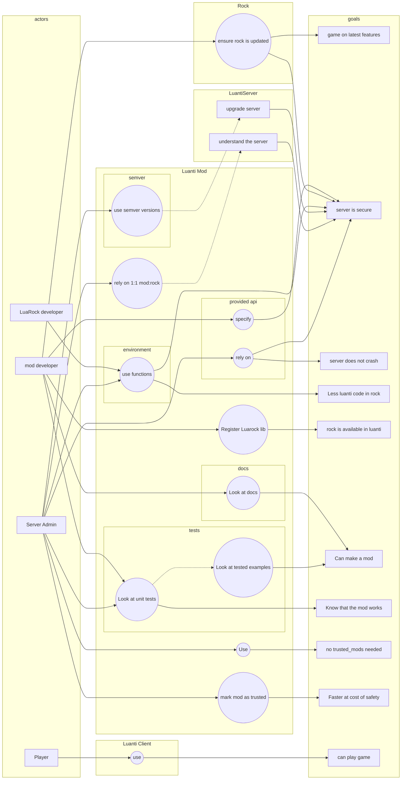

<!--
SPDX-FileCopyrightText: 2025 Lazerbeak12345 on Github and contributors

SPDX-License-Identifier: MIT
-->

# Development Requirements for Luanti LuaRocks Wrapper

> The key words "MUST", "MUST NOT", "REQUIRED", "SHALL", "SHALL
> NOT", "SHOULD", "SHOULD NOT", "RECOMMENDED",  "MAY", and
> "OPTIONAL" in this document are to be interpreted as described in
> RFC 2119 and RFC 8174.

## Purpose of this document

Ths purpose of this document is to describe, clearly, what this project intends to do.

As made clear above, we'll be using RFC's 2119 and 8174 in this document.

## Requirements

### Mod Requirements

1. This mod MUST provide an API to register and load Luarocks libraries, so long as they are packaged with the dependant developer's code appropriatly.
2. This mod MUST NOT require use of `secure.trusted_mods`
3. This mod MUST implement a custom environment that includes an accurate and secure `require` function.
4. This mod MUST prevent security exploits.
5. This mod MAY provide an opt-in method for server administrators and singleplayers to use `secure.trusted_mods` to improve performance of these libraries at potential cost to security. If this is done we MUST inform users of the inherent risks.
6. Documentation MUST be provided.
7. Comprehensive unit testing SHOULD be developed.
8. Mod MUST recreate the insecure environment as close as is possible for the LuaRock, especially the `require` function, which internally behaves differently. More details will be provided in the design documents.
9. Mod MUST be forward compatible.
10. Mod MAY be backward compatible.
11. Backward incompatibilities MUST be tracked with semver.
12. Mod MUST provide APIs to provide a single (1) LuaRocks package as a single Luanti package.
13. Mod MUST provide ways for the code in the Luanti package to provide a lmited form of the wrapped rock.

### Tooling Requirements

1. This tooling MAY provide a way to manage and update LuaRocks dependencies.
2. Documentation MUST be provided.
3. Comprehensive unit testing SHOULD be developed.
4. Tooling MUST be forward compatible.
5. Tooling MAY be backword compatible.
6. Backword incompatibilities MUST be tracked with semver.

## User stories

<!--
- As a **mod developer** I want to **** so that ****.
- As a **Server Admin** I want to **** so that ****.
- As a **luarocks developer** I want to **** so that ****.
- As a **player** I want to **** so that ****.
-->

- As a **luarocks developer** I want to **rely on an environment resembling luajit** so that **I need less luanti code**.
- As a **luarocks developer** I want to **use the require function** so that **I need less luanti code**.
- As a **mod developer** I want to **register a LuaRocks library** so that **the library is available for use in luanti**.
- As a **mod developer** I want to **read the docs** so that **I can make a mod**.
- As a **mod developer** I want to **look at unit tests** so that **I have tested examples**.
- As a **mod developer** I want to **cherry pick the rock API** so that **only secure things can be done**.
- As a **mod developer** I want to **update the wrapped rock** so that **the latest features and security patches are available**.
- As a **Server Admin** I want to **use this mod** so that **I don't need trusted_mods**.
- As a **Server Admin** I want to **be able to trust a wrapped rock** so that **I can improve performance at cost of security**.
- As a **Server Admin** I want to **look at unit tests** so that **I know the mod works**.
- As a **Server Admin** I want to **rely on environment resembling luajit** so that **the server is secure**.
- As a **Server Admin** I want to **see semver versions** so that **I understand how and when to upgrade the server**.
- As a **Server Admin** I want to **see a 1:1 mod:rock relationship** so that **I know what's installed, and have less duplicate code**.
- As a **Server Admin** I want to **have cherrypicked rock APIS** so that **insecure things won't crash the server**.
- As a **player** I want to **use any luanti client** so that **I can play the game**.

## Use-cases

